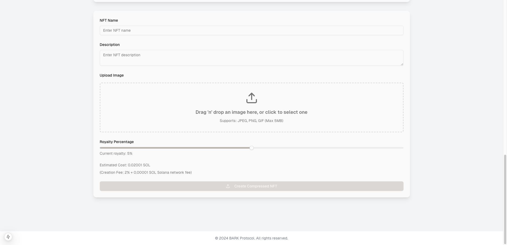
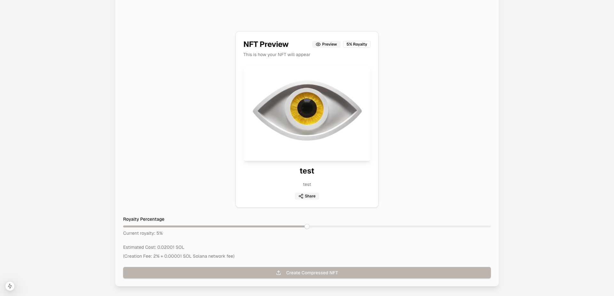

# BARK | Blinks As A Service Web UI/UX  

Welcome to the **BARK - BLINKS** project! This repository hosts the frontend code for the BARK Protocol’s **Blinks As A Service Platform**, built with **Next.js 15**, **React 19**, and **Tailwind CSS**. The platform delivers an intuitive, high-performance web interface for creating, managing, trading, and staking digital assets—Blinks—on the Solana blockchain.  

## Table of Contents  

- [Overview](#overview)  
- [Features](#features)  
- [Blinkboard (Dashboard)](#blinkboard)  
- [Web Interface and Logic](#web-interface-and-logic)  
- [Use Cases](#use-cases)  
- [Screenshots](#screenshots)  
- [Getting Started](#getting-started)  
- [Technologies Used](#technologies-used)  
- [Project Structure](#project-structure)  
- [API Routes](#api-routes)  
- [Contributing](#contributing)  
- [ToDo](#todo)  
- [License](#license)  
- [Acknowledgements](#acknowledgements)  

---

## Overview  

**BARK Blink** is a decentralized application (dApp) built for effortless digital asset management. It empowers users to create, transfer, trade, and stake Blinks, leveraging Solana's scalable blockchain infrastructure. From NFTs and SPL tokens to airdrops and wallet-to-wallet transactions, BARK Blink combines simplicity, security, and advanced functionality to redefine digital asset management.  

---

## Features  

- **Blink Creation and Customization**: Mint NFTs or SPL tokens with configurable metadata and royalty settings.  
- **Portfolio Management**: Organize and track assets using an intuitive Blinkboard.  
- **Integrated Marketplace**: Seamlessly trade Blinks on supported platforms.  
- **Secure Wallet Connection**: Supports Phantom, Solflare, and Backpack wallets for easy transactions.  
- **Real-Time Notifications**: Stay updated on transaction status and portfolio changes.  
- **Analytics Tools**: Gain insights into Blink performance and trends.  
- **Staking Rewards**: Earn dynamic rewards through NFT and token staking pools.  
- **Social Sharing**: Share your unique Blinks across social media platforms.  

---

## Blinkboard (Dashboard)  

The **Blinkboard** is the heart of the BARK Blink platform, offering a comprehensive view of assets and activities.  

### Key Features  

- **Portfolio Tracking**: Monitor Blink valuation in real-time.  
- **Transaction History**: Review past activities with detailed analytics.  
- **Blink Creation**: Customize and mint new digital assets.  
- **Marketplace Access**: Buy, sell, and auction Blinks.  
- **Rewards Management**: Stake NFTs or tokens and manage rewards.  
- **User Profiles**: Personalize your experience with custom settings.  
- **Social Interactions**: Engage with updates, notifications, and the community.  

---

## Web Interface

The BARK Blink web interface is optimized for both simplicity and power, built with:  

- **Next.js**: Ensures a fast, scalable web experience.  
- **React**: Enables dynamic, component-based architecture.  
- **Tailwind CSS**: Simplifies UI development with a responsive, utility-first design system.  
- **Wallet Integration**: Secure wallet connections via Phantom, Solflare, and Backpack.  
- **API Communication**: REST APIs manage Blink creation, trading, and transactions.  
- **Blockchain Interactions**: `@solana/web3.js` powers asset minting, transfers, and staking.  
- **State Management**: React Context API ensures seamless data flow and live updates.  

---

## Use Cases  

1. **Creative Economy**:  
   Enable creators to mint and sell NFTs with royalty enforcement.  

2. **Community Building**:  
   Reward loyal users with token airdrops and exclusive collectibles.  

3. **Gamified Experiences**:  
   Issue game assets and in-app currencies as blockchain tokens.  

4. **Charitable Campaigns**:  
   Host transparent fundraisers with tokenized donations.  

5. **Decentralized Governance**:  
   Empower communities with token-based voting systems.  

6. **Loyalty Programs**:  
   Tokenize rewards for small businesses to engage customers.  

7. **Cross-Platform Partnerships**:  
   Collaborate with other dApps for liquidity provisioning and advanced features.  

---

## Screenshots  

### Light Landing Page  


### Dark Landing Page
  

### Blinkboard  
  

### Create NFTs  
 

### NFT Preview
  

---

## Getting Started  

### Prerequisites  

- **Node.js** (v18 or later)  
- **pnpm** or **yarn**  
- **Solana CLI** (for local testing)  

### Installation  

1. Clone the repository:  
   ```bash
   git clone https://github.com/bark-protocol/blinks-as-a-service-dapp.git
   ```  

2. Install dependencies:  
   ```bash
   pnpm install  
   ```  

3. Configure environment variables:  
   ```bash
   NEXT_PUBLIC_SOLANA_NETWORK=mainnet-beta
   NEXT_PUBLIC_SOLANA_RPC_URL=https://api.mainnet-beta.solana.com
   PINATA_API_KEY=your_pinata_api_key
   PINATA_SECRET_API_KEY=your_pinata_secret_api_key
   ```  

4. Start the development server:  
   ```bash
   pnpm run dev  
   ```  

5. Open [http://localhost:3000](http://localhost:3000) in your browser.  

---

## API Routes  

- **`/api/v1/create-blink`**: Mint a new Blink.  
- **`/api/v1/transfer-blink`**: Send a Blink to another user.  
- **`/api/v1/list-blinks`**: Retrieve all Blinks owned by a user.  
- **`/api/v1/stake-blink`**: Stake Blinks to earn rewards.  
- **`/api/v1/get-rewards`**: Fetch staking rewards.  

---

## Contributing  

We welcome contributions to the BARK Blink project!  

1. Fork the repository.  
2. Create a feature branch:  
   ```bash
   git checkout -b feature/new-feature  
   ```  
3. Make your changes and commit them.  
4. Submit a pull request for review.  

---

## License  

This project is licensed under the MIT License. See the [LICENSE](LICENSE) file for details.  

---

## Acknowledgements  

- [Solana Blockchain](https://solana.com/)  
- [Next.js Framework](https://nextjs.org/)  
- [React Library](https://reactjs.org/)  
- [Tailwind CSS](https://tailwindcss.com/)  
- [Anchor Framework](https://www.anchor-lang.com/)  
